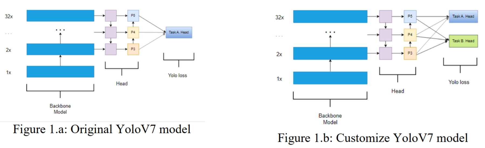

# YOLOv7 model customization

YoloV7 has shown impressive performance on object detection, recognition, etc on multiple objects (Figure 1.a). For there, In this task, we want to customize the backbone model with multitask learning which reduce number of models when deploy on edge device. The model using the architecture of YoloV7 but expand a multiple head (Figure 1.b)

 

REQUIREMENTS

Customize a YoloV7 backbone using the original repo [WongKinYiu](https://github.com/WongKinYiu/yolov7):
- The Task A. Head for 1st column of Fig 2 (person, bicycle,… traffic light)
- The Task B. Head from 2nd column to the left one (fire hydrant,… toothbrush)

Training on COCO dataset on classification [download here](http://images.cocodataset.org/zips/val2017.zip):
- The data is a sub-dataset from COCO with ~5k samples (1GB) for testing
- The training scripts MUST load his author YoloV7 pretrained weight on COCO ([here](https://github.com/WongKinYiu/yolov7/releases/download/v0.1/yolov7.pt))

## Getting started

### 1. Prerequisites

- Python <=3.8
- CUDA 11.8 (if possibble or CPU is acceptable)

### 2. Installation

#### 2.1. Use the package manager [pip](https://pip.pypa.io/en/stable/) to install the requirements.txt file.

```bash
  pip install requirements.txt
```

#### 2.2. Or open the [YOLOv7_notebook_1.ipynb](https://github.com/sirrtt/K-and-G-Technology-Test/blob/main/YOLOv7_notebook_1.ipynb) and run every cell one by one on Google Colab.

#### 2.3. Or open the [YOLOv7_notebook_2.ipynb](https://github.com/sirrtt/K-and-G-Technology-Test/blob/main/YOLOv7_notebook_2.ipynb) and run every cell one by one on your local machine.

### 3. Usage

- Clone the repository to your local machine.
- Ensure you have the required libraries installed (mentioned in prerequisites).
- Replace the placeholder dataset loading and model definitions in the script with your specific data and models.
- Run the [YOLOv7_notebook_1.ipynb](https://github.com/sirrtt/K-and-G-Technology-Test/blob/main/YOLOv7_notebook_1.ipynb) file on Google Colab or [YOLOv7_notebook_2.ipynb](https://github.com/sirrtt/K-and-G-Technology-Test/blob/main/YOLOv7_notebook_2.ipynb) on your local machine.

## Results:

I have not finished or have the end result for this task due to several problems below:
- There has been no experiment of multitask learning on YOLOv7 before (reference problem).
- There are 2 ways of multitask learning: Hard Parameter Sharing and Soft Parameter Sharing. With Hard Parameter Sharing, I need to modify the head of the model in the [myyolov7.yaml](https://github.com/sirrtt/K-and-G-Technology-Test/blob/main/yolov7/cfg/training/myyolov7.yaml) so that it can load into the [yolo.py](https://github.com/sirrtt/K-and-G-Technology-Test/blob/main/yolov7/models/yolo.py) in the [models](https://github.com/sirrtt/K-and-G-Technology-Test/tree/main/yolov7/models) folder. With the Soft Parameter Sharing, I need to modify the head of the model in the [myyolov7_2.yaml](https://github.com/sirrtt/K-and-G-Technology-Test/blob/main/yolov7/cfg/training/myyolov7_2.yaml) so that it can load into the [yolo_2.py](https://github.com/sirrtt/K-and-G-Technology-Test/blob/main/yolov7/models/yolo_2.py) in the [models](https://github.com/sirrtt/K-and-G-Technology-Test/tree/main/yolov7/models) folder. However, with this technique I need to fix the [yolo_2.py](https://github.com/sirrtt/K-and-G-Technology-Test/blob/main/yolov7/models/yolo_2.py) file and currently have not finished yet (architecture problem).
- By customizing the YOLOv7 model, the pretrained weight may cause some conflicts to the new architecture due to different architecture. Therefore, may need to train the model from scratch (architecture problem).
- The provided dataset has 48 missing labels (dataset problem).
- For multitask learning, we may need 2 seperated dataset for 2 heads of task A and B. However, the provided dataset is not in that format (dataset problem).
- Cannot train on local machine due to number of classes are not equal to the dataset (dataset problem).
- Cannot train on Google Colab due to mismatch CUDA version or problems with CUDA (device problem).
- Large dataset lead to small batch size at around 2, 4 or 8 (hardware resource problem).

## Further Exploration:

- Try to dive deep into the [models](https://github.com/sirrtt/K-and-G-Technology-Test/tree/main/yolov7/models) folder so that I can modify the [yolo.py](https://github.com/sirrtt/K-and-G-Technology-Test/blob/main/yolov7/models/yolo.py) to make multitask learning possible.
- Try to identify the dataset problem.
    
## License

[MIT](https://choosealicense.com/licenses/mit/)

